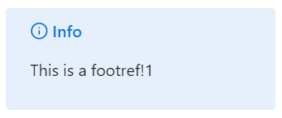
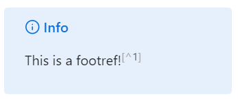

# Obsidian Footrefs in Live Preview

| before installing | after installing |
|--------|-------|
|  |  |

## Features

- Better rendering of footrefs in callouts

## Install

You can install this plugin using [BRAT](https://github.com/TfTHacker/obsidian42-brat).
